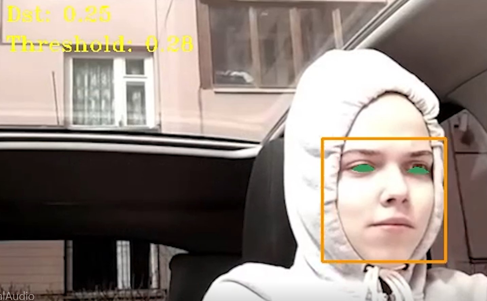

# No Sleep

Software that detects when a person falls asleep and alerts them with a loud alarm.

## Features

- Uses landmark detection on the face to predict when the person has closed their eyes.
- Features a custom trained drowsiness detecion AI to dynamically make the detection more or less sensitive.
- The program's trigger sensitivty can be adjusted during operation and is saved every run. 

## Example Detecion

## Tech Stack
Python, OpenCV, YoloV5, Dlib 

